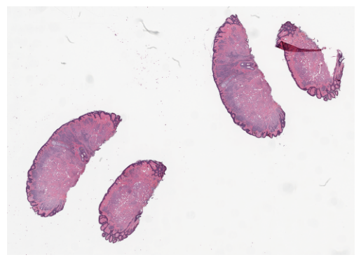
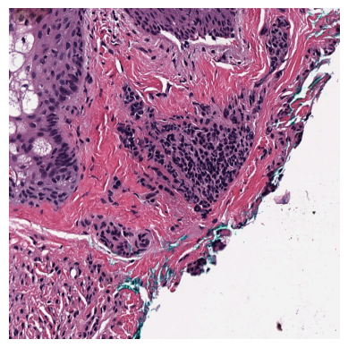

Hello! Here we are going to show you how to get started with SCEMATK. We will download an image and show you how to open it and visualise it using Python. It is not necessary for this section that you are connected to a HPC or cloud computing service, we will cover this in the next section.

## Installation

SCEMATK is available on PyPI and can be installed using pip. To install SCEMATK run the following command:

```bash
pip install scematk
```

## Downloading Example Image

To get started we will download an example image to work with. We will use the `download_example` function from SCEMATK to download an example image. Open up a Jupyter notebook (to make following tutorials quicker, you will want to create this on HPC if you have access to one, although not strictly needed here) and then run the folling code (this may take a couple of minutes):

```python
from scematk.data import download_example

download_example()
```

Once this has finished, you should see a new file in the same directory as your Jupyter notebook called `getting_started.svs`.

## Converting an Image

To enable Dask to properly parallelise the image processing we need to convert the image to a format that Dask can work with. In this case we need to take the `.svs` image (a kind of TIFF) and convert it to a `zarr` file. In doing this though, we will lose some of the metadata associated with the image, so as well as creating the `zarr` file we will also create a `json` file that contains the metadata. To do this run the following code:

```python
from scematk.io import tiff_to_zarr

tiff_to_zarr('getting_started.svs', 'getting_started.zarr', 'getting_started.json')
```

This takes the TIFF we just downloaded (`getting_started.svs`) and converts it to a `zarr` file (`getting_started.zarr`) and a `json` file (`getting_started.json`). The `json` file contains the metadata that was lost in the conversion.

## Opening an Image

Now that we have the image in a format that can be read in parallel by dask, we can open it using the `read_zarr_img` function.

```python
from scematk.io import read_zarr_img

image = read_zarr_img('getting_started.zarr', 'getting_started.json')
image
```


This will return a SCEMATK image object. This object is mainly comprised of 3 things, the first of these is a Dask Array that contains the highest resolution image available in the TIFF. If you want to, you can see this Dask Array by running `image.image` in the Jupyter notebook. The second part of the object is a dictionary that contains the metadata that was stored in the `json` file, this can be seen by running `image.info`. The third is a list of the channel names, this can be seen by running `image.channel_names`, by default SCEMATK assumes the image you are reading is RGB. If your image is not RGB you can set the channel names inside the `read_zarr_img` function using the `channel_names` argument. Typically, as a user, you will not have to interact with the `image` object directly, but it is useful to know what is inside it. The other functions in SCEMATK will read and convert the image, image metadata and channel names for you.

## Visualising an Image

The reason that no image is returned when you print the SCEMATK image object is because SCEMATK does not load the image into Python until the very last second where it really has to and when it does it does it in chunks and not necessarily all at one time. This is because the images that we are working with are very large and loading them all at once would be very memory intensive. However, we need to be able to see the images sometimes and SCEMATK has a couple of ways of doing this. 

The first way is the use the `show_thumb` method. This will operate over the image and scale it down to a target pixel size. It's important to note again, that there is no thumbnail of the image stored locally and it is recalculated every time you call the method. This is extremely useful further along in SCEMATK workflows but does mean they can take a few seconds to appear here. Here is an example of calling the `show_thumb` method on our example image:

```python
image.show_thumb()
```



Rather than visualising the whole of the WSI, you can also plot just a small region using the `show_region` method. This method takes 4 arguments, the first two are the y and x coordinates of the top left corner of the region you want to plot, the second two are the height and width of the region you want to plot. Here is an example of calling the `show_region` method on our example image:

```python
image.show_region(20000, 10000, 1000, 1000)
```

