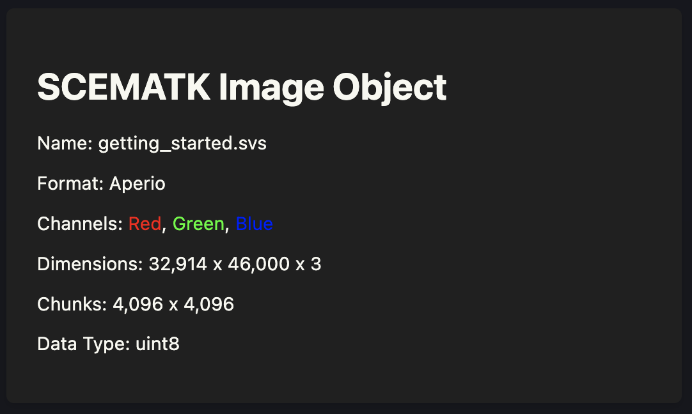
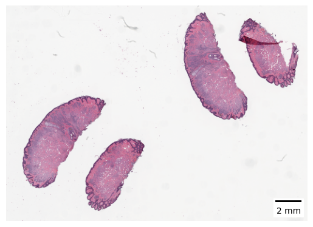

Hello! Here we are going to show you how to get started with SCEMATK. We will download an image and show you how to open it and visualise it using Python.

## Installation

SCEMATK is available on PyPI and can be installed using pip. To install SCEMATK run the following command:

```bash
pip install scematk
```

## Downloading Example Image

To get started we will download an example image to work with. We will use the `download_example` function from SCEMATK to download an example image. Open up a Jupyter notebook and then run the following code (this may take a couple of minutes):

```python
from scematk.data import download_example

download_example()
```

Once this has finished, you should see a new file in the same directory as your Jupyter notebook called `getting_started.svs`.

## Converting an Image

To enable Dask to properly parallelise the image processing we need to convert the image to a format that Dask can work with. In this case we need to take the `.svs` image (a kind of TIFF) and convert it to a `zarr` file. In doing this though, we will lose some of the metadata associated with the image, so as well as creating the `zarr` file we will also create a `json` file that contains the metadata. To do this run the following code:

```python
from scematk.io import tiff_to_zarr

tiff_to_zarr('getting_started.svs', './raw_image/getting_started.zarr', './raw_image/getting_started.json')
```

This takes the TIFF we just downloaded (`getting_started.svs`) and converts it to a `zarr` file (`getting_started.zarr`) and a `json` file (`getting_started.json`). The `json` file contains the metadata that was lost in the conversion.

## Opening an Image

Now that we have the image in a format that can be read in parallel by dask, we can open it using the `read_zarr_img` function.

```python
from scematk.io import read_zarr_ubimg

image = read_zarr_ubimg('./raw_image/getting_started.zarr', './raw_image/getting_started.json')
image
```



This output shows basic information about the image but does not load the image into memory. When using SCEMATK images are only loaded into memory for three reasons: to save a new image that has been created, to fit a model or to display an image. Otherwise, when applying functions to an image rather than actioning them straight away SCEMATK will save those instructions and perform them all at once. This is how SCEMATK is able to handle data that is larger than the amount of memory available to your computer.

## Viewing an Image

These SCEMATK image objects have a lot of functionality to allow you to view them. The simplest of these is the `show_thumb` method that will calculate and then show you a thumbnail of the current image. Remember that this thumbnail is being dynamically calculated and displayed and therefore there may be some processing time required to display it.

```
image.show_thumb()
```

