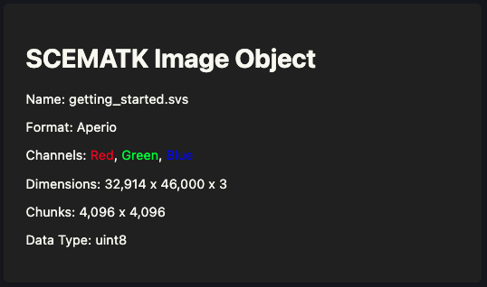
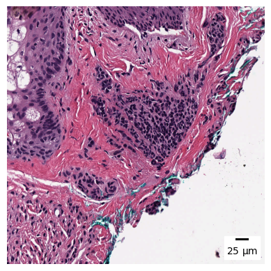
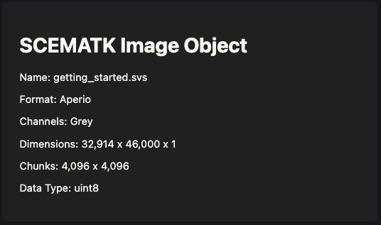
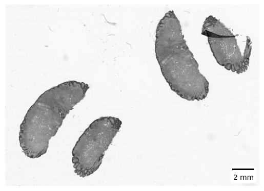
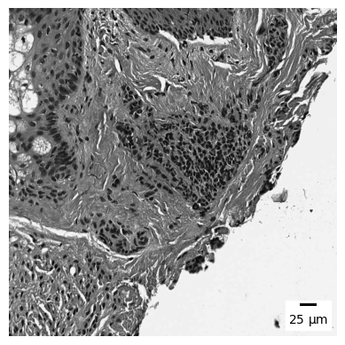
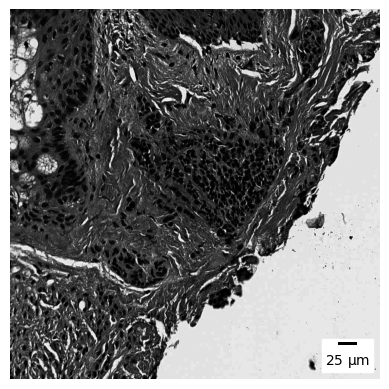
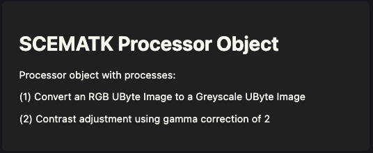

SCEMATK has various ways of analysing an image but one of the fundamental objects used in pipelines are SCEMATK processes. In SCEMATK, a process is a function that performs some basic transformation to an image (processes can also be performed on masks, as SCEMATK considers masks as a subset of images).

# SCEMATK Processes

Firstly, we can open up and visualise the image that we downloaded in section 1.

```python
from scematk.io import read_zarr_ubimg

image = read_zarr_ubimg("./raw_image/getting_started.zarr", "./raw_image/getting_started.json")
image
```



We can view a thumbnail and a region of this image as shown in the previous section.

```python
image.show_thumb()
```


```python
image.show_region(20000, 10000, 1000, 1000)
```



A simple transformation that we may wish to apply to this image would be to convert it to greyscale. Transformations such as these are done through processes, you can load up a process that will convert an image from RGB to greyscale like this:

```python
from scematk.process.colour import RGBToGrey

greyscale_image = RGBToGrey().run(image)
greyscale_image
```



This function runs (or should run!) almost instantly. This is because, as said in the first section, no part of the image has actually been converted to greyscale yet, it has just saved the instructions that this image should be converted to greyscale when it is calculated.

We can then use the `show_thumb` and `show_region` methods to see what this greyscale image looks like:

```python
greyscale_image.show_thumb()
```



```python
greyscale_image.show_region(20000, 10000, 1000, 1000)
```



These images should take slightly longer to appear than the raw ones as SCEMATK converts the image to greyscale and then computes the thumbnail. However, you should notice that the region is always much faster than the thumbnail as SCEMATK will only compute information needed for the output that you have requested and therefore won't waste any computations calculating the values of pixels outside the requested region.

Let's say now you would like to increase the contrast in the greyscale image, this can be done by running another process object.

```python
from scematk.process.contrast import GammaContrast

contrast_image = GammaContrast(2).run(greyscale_image)
contrast_image
```


We can again view how this has changed the image.

```python
contrast_image.show_thumb()
```


```python
contrast_image.show_region(20000, 10000, 1000, 1000)
```



You will probably notice at this point that with every process we add the images take longer and longer to compute. This is because each time a process is applied to an image it is another set of instructions that need to be run every time the image is computed. It may be annoying, but this is what keeps SCEMATK lightweight and able to process complex functions on very large images as none of it sticks about in memory. If you are working on an image that has had lots of transformations or other operations applied it is often quicker to save the image and then read in that saved image as new SCEMATK image object. This is because SCEMATK no longer has to apply these transformations every single time as it is reading the transformed image directly from the disk. We can do this like this:

```python
contrast_image.save("./processed_image/image.zarr", "./processed_image/meta.json")
contrast_image = read_zarr_ubimg("./processed_image/image.zarr", "./processed_image/meta.json", channel_names="grey")
```

Now when we show the image thumbnail the speeds should be similar to when we were working with the raw image.

```python
contrast_image.show_thumb()
```


# SCEMATK Processors

If you are applying multiple processes at once (or tuning a SCEMATK module later on) you will want to group your processes together in a processor. A processor is a SCEMATK object that will consecutively apply SCEMATK processes.

We can easily build a processor with the two processes we have applied

```python
from scematk.process import Processor

processor = Processor([RGBToGrey(), GammaContrast(2)])
processor
```



We can then apply this to an image and it works like successively applying each process:

```python
processed_image = processor.run(image)
processed_image.show_thumb()
```


