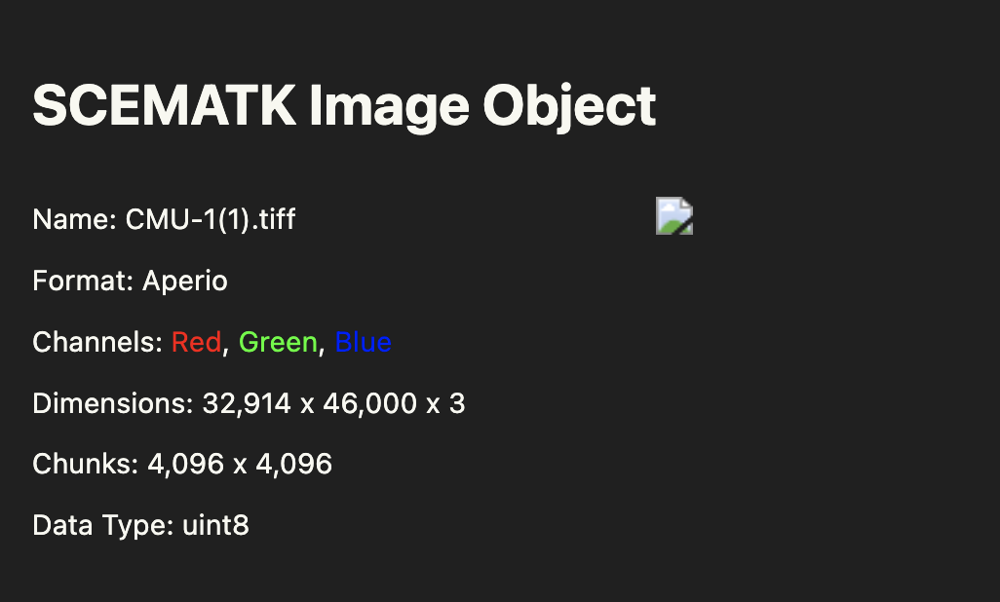
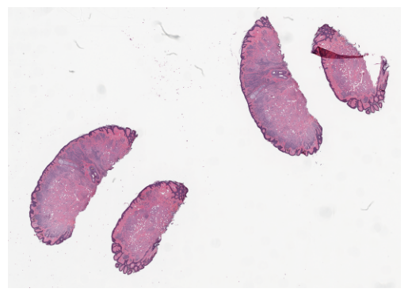
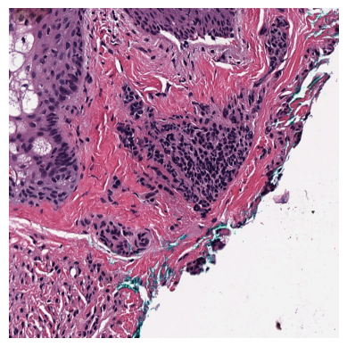

Processors and processes are integral to how SCEMATK works. SCEMATK considers most basic image trasnformations and manipulations as processes. This can include processes such as blurring and image, adjusting the contrast or converting and image to greyscale. These are typical operations you might want to perform on an image before you try segmenting it or performing stain deconvolution. A processor is just an object that contains a list of processes that you want to perform on an image and will perform them sequentially when asked.

## Processes

To have a look at applying processes to an image, let's load the image from the previous tutorial and look at the image thumb and an example region

```python
from scematk.io import read_zarr_img

image = read_zarr_img('getting_started.zarr', 'getting_started.json')
image
```



```python
image.show_thumb()
```



```python
image.show_region(20000, 10000, 1000, 1000)
```



All of the processes that are available in SCEMATK are stored in the `scematk.process` module.