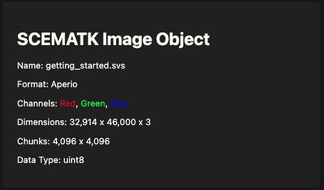
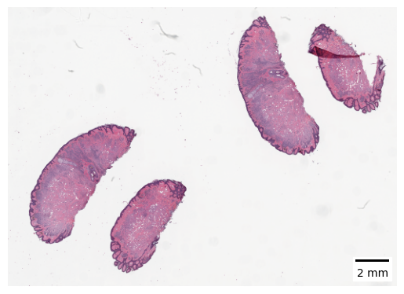
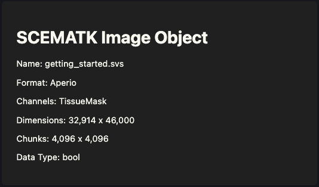
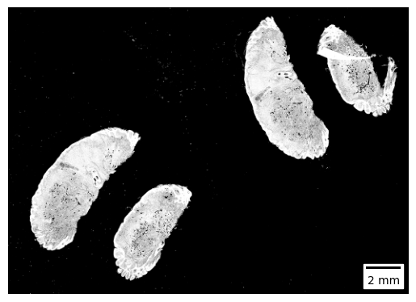
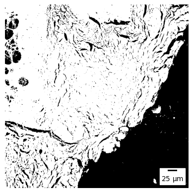
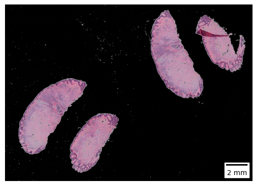
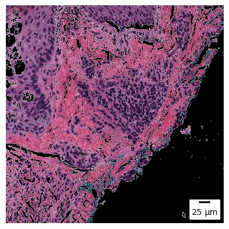
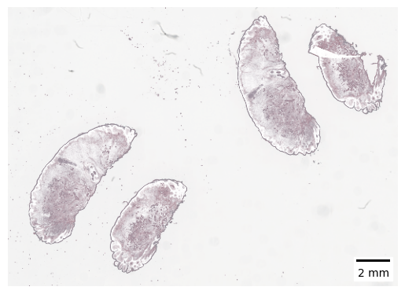
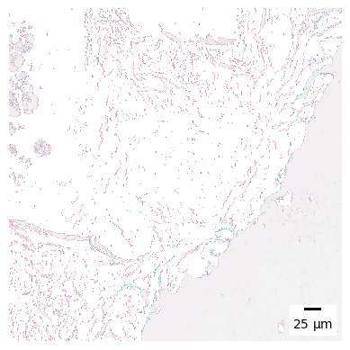

In this section we are going to look at how to segment tissues using SCEMATK. By segmenting a tissue here we specifically mean identifying the regions of an image that contain tissue. To do this we will be creating a tissue mask, in this case this mask will be a binary mask which is a two dimensional array the same size as the image of true/false values, with `true` indicating that that pixel is within the tissue and `false` indicating it is not.

# SCEMATK Modules

SCEMATK uses objects called "modules" for analysis such as this. A module consists of three parts, the first is a preprocessor, if you don't know what a SCEMATK processor is please read the previous section of this documentation. This preprocessor transforms the image before being analysed, we will look later in this section why you may wish to do this. The second part is the actual analysis that the module is for, in our case this is actually calculating which parts of the image contains tissue. The last part is a postprocessor which again is a SCEMATK processor that performs some manipulations to the image. In most cases the default preprocessors and postprocessors don't actually perform any transformations on the image.

Before we start let's load up the image that we have been working on previously in this documentation.

```python
from scematk.io import read_zarr_ubimg

image = read_zarr_ubimg("./raw_image/getting_started.zarr", "./raw_image/getting_started.json")
image
```



```python
image.show_thumb()
```



# Segment Tissue

To segment the tissue, we are going to use Otsu's method. To do this let's load up an Otsu thresholder from SCEMATK.

```python
from scematk.segment.tissue import OtsuThresholder

otsu_thresholder = OtsuThresholder()
```

For more information on Otsu's method for image segmentation you can read more [here](https://en.wikipedia.org/wiki/Otsu%27s_method). Otsu's method requires us to fit the thresholder, this can be done like this:

```python
otsu_thresholder.fit(image)
```

Fitting modules is one of the three actions that causes an image to compute, this is why this process is not instantaneous. After fitting, we can then run the thresholder on the image to generate a tissue mask.

```python
tissue_mask = otsu_thresholder.run(image)
tissue_mask
```



# Visualising the Tissue Mask

As you can see, SCEMATK considers this mask to be an image, therefore we can visualise it like an image using the `show_thumb` and `show_region` methods.

```python
tissue_mask.show_thumb()
```



```python
tissue_mask.show_region(20000, 10000, 1000, 1000)
```



But seeing these masks with no context is not useful. This is why SCEMATK allows you to overlay this mask on the original image to see whaat parts are considered tissue. To do this, visualise the image and then set the overlay argument to the tissue mask, for a binary mask this will set the background regions to black.

```python
image.show_thumb(overlay=tissue_mask)
```



```python
image.show_region(20000, 10000, 1000, 1000, overlay=tissue_mask)
```



We can also invert this overlay so that the region that is considered tissue will be shown in white and only the background is shown. This is useful to find any regions that were missed by the tissue mask.

```python
image.show_thumb(overlay=tissue_mask, invert_overlay=True)
```



```python
image.show_region(20000, 10000, 1000, 1000, overlay=tissue_mask, invert_overlay=True)
```

