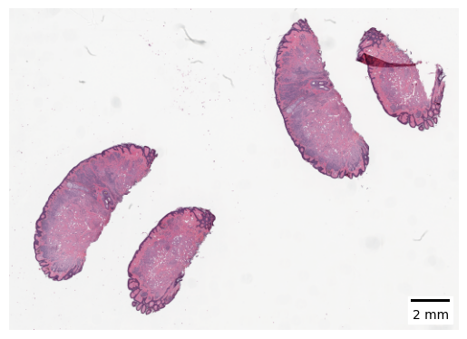

Hello! Here we are going to show you how to get started with SCEMATK. We will download an image and show you how to open it and visualise it using Python.

# Stain Deconvolver

Just like with segmenting a tissue, there is a module for deconvolving stains. Again, lets start by loading our example image.

```python
from scematk.io import read_zarr_ubimg

image = read_zarr_ubimg("./raw_image/getting_started.zarr", "./raw_image/getting_started.json")
image
```


Again, we can see how this looks raw.

```python
image.show_thumb()
```



Now lets load up the deconvolution module and apply it to the image.

```python
from scematk.deconvolve import NativeSKImageStainDeconvolver

nskid = NativeSKImageStainDeconvolver()
deconv_img = nskid.run(image)
deconv_img
```


Here you can see that SCEMATK has registered that the channels have changed from RGB to H&E (if you are working on H-DAB images you can add the argument `stain_type='H-DAB'` to the deconvolution module). We can run this deconvolution to see the resultant image.

```python
deconv_img.show_thumb()
```


# Viewing Deconvolved Images

As you can see, this deconvolved image is quite faint. We might want to view the output of the deconvolved image as a brighter image without affecting the underlying image itself. We can do this using a SCEMATK process as shown in section 2 with a linear contrast boost of 5. This will create a new SCEMATK image object that we can directly call the thumbnail of without saving it, just to view the deconvolved image. 

```python
from scematk.process.contrast import LinearContrast

LinearContrast(5).run(deconv_img).show_thumb()
```


# Saving and Loading the Image

For use in later sections, we can save this image out to disk.

```python
deconv_img.save('doconv_image/image.zarr', 'deconv_image/meta.json')
```

However, when we load the image back in, SCEMATK will assume it is an RGB image, so we need to specify that the image stains are Hematoxylin and Eosin (or whatever stains you are using).

```python
deconv_img = read_zarr_ubimg('./deconv_image/image.zarr', './deconv_image/meta.json', channel_names=['Hematoxylin', 'Eosin'])
```
