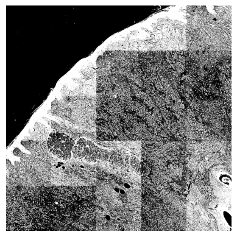
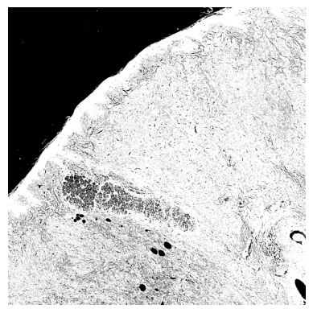
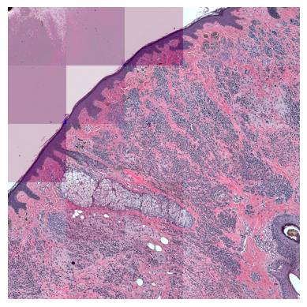
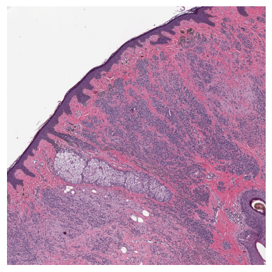

WSI stands for 'whole slide image' so treating them 'as a whole' seems to be intuitive, in this section we will discuss what this means and why it is important.

So, WSI's are *big*. Very big. Too big to fit into a reasonable amount of memory. This means that when we analyse them we *have* to split them up into smaller chunks (often called "tiling the image") and then analyse these smaller chunks. There is nothing wrong in this approach and is also how SCEMATK handles these very large images. The problem comes when these tiles are processed differently from one another. If you are only interested in using one tile at a time, then this may not cause an issue, but the SCEMA-WSI isn't just interested in analysing the morphology of a single cell, it is interested in comparing and contrasting the morphologies of these cells to the cells that surround them. To effectively do this, all regions of the image need to have been processed in the same way. Here we hope to show you different examples of how tiling images separately can affect the results of your analysis.

Firstly, let's look at an example of tissue segmentation. One way to segment a tissue is using a thresholding algorithm, in this case we will be using Otsu's method. To deal with the large sizes of WSI's, we can tile the image into smaller chunks and then apply the thresholding algorithm to each tile. If we do this, we end up with a tissue mask that looks like this:

Here you can see the distinct tiles that comprise the image and where the segmentation algorithm has been applied to each tile separately. Even though each tile had the same algorithm applied to it, the results are not consistent across the image as the algorithm relies on global intensiy information. SCEMATK uses a different approach to apply the same algorithm, it also tiles the image but it calculates the intensity histogram for each tile and then globally aggregates them. It then uses this to calculate a global threshold and then applies the global threshold to each tile to create a consistent tissue mask across the image. This is what the tissue mask looks like when the algorithm is applied in this way:

We have used tissue segmentation as an example here as it clearly shows the issue of inconsistent application of the same algorithm across different tiles. But this problem is present in every step of the analysis of WSI's. Another example we can show here is that of stain normalisation. We trained a stain normalisation algorithm on this whole image and then applied it to each tile separately. The results are shown below:

This is compared to the image when the normalisation algorithm is applied to the whole image:

When analysing each tile on its own, these inconsisties between them might not have too much of an effect. But with the current move towards spatial biology and not just trying to analyse one section of tissue, but how that section of tissue compares to the section around it, it is important that the image is as consistent as possible.